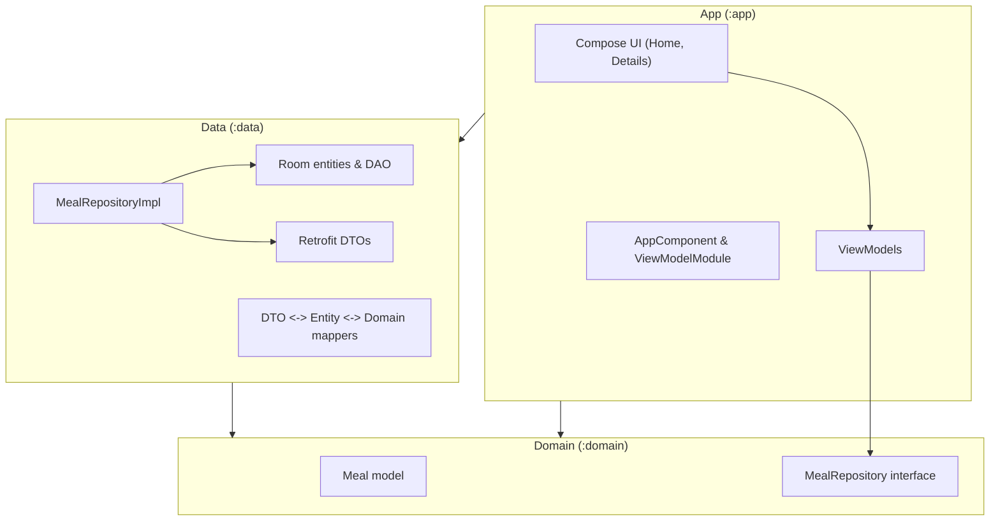

# Android Clean Architecture Template

A production-ready **Android app template** built with **Kotlin**, **Jetpack Compose**, **Clean Architecture**, and **Dagger 2**, using **Room** as the single source of truth and **Retrofit** to consume TheMealDB API.

This project is meant to be a **starting point for real-world apps** that need a modular, testable, and maintainable architecture.

---

## ✨ Features

- **Multi-module Clean Architecture**
  - `:app` – UI, navigation, application startup, DI entry point
  - `:domain` – pure business models and repository interfaces
  - `:data` – Room, Retrofit, mappers, repository implementations, data DI
- **Modern UI**
  - Jetpack Compose + Material 3
  - Home screen with list of meals and favorite toggles
  - Details screen with image, category, area, ingredients, instructions, and external links
  - Environment badge (`DEV` / `PROD`) visible in the UI
- **Data & Networking**
  - TheMealDB API (e.g. `lookup.php?i={idMeal}`)
  - Retrofit + Moshi + OkHttp (with logging interceptor)
  - Room as **single source of truth** (DB is always the source for UI)
  - Mapping between DTO → Entity → Domain model
- **Async**
  - Kotlin Coroutines + Flow
  - Reactive UI state in ViewModels
- **Dependency Injection**
  - Dagger 2 with:
    - `AppComponent` in `:app`
    - Data-related modules (DB, network, repository) in `:data.di`
    - ViewModel multibinding via Dagger

---

## 🧱 Clean Architecture Overview

This project follows a variant of **Robert C. Martin’s (Uncle Bob) Clean Architecture**, adapted to Android.

The core idea:

> **Business rules should not depend on frameworks, UI, or external data sources.  
> Instead, frameworks and data sources depend on the business rules.**

### Layers in this project

We map classic Clean Architecture concepts to modules like this:

| Clean Architecture concept | This project                          |
|----------------------------|----------------------------------------|
| Entities / Business rules  | `:domain` module                       |
| Use cases / Interactors   | (can live in `:domain`, optional)      |
| Interface adapters         | `:data` (repositories, mappers, DAOs) |
| Frameworks & UI            | `:app` (Compose UI, Android, DI)      |

### Dependency rule

**All dependencies point inward.**  
Inner layers don’t know anything about outer layers:


app    (UI, Android, DI)   → depends on → domain, data
data   (DB, network, repo) → depends on → domain
domain (business rules)    → depends on → nothing


:domain has no Android imports and no Room/Retrofit.
:data implements interfaces defined in :domain.
:app uses the abstractions from :domain and the implementations from :data.


## 🧱 Clean Architecture Overview



Domain defines what the app needs (Meal, MealRepository).

Data defines how data is fetched/stored (Room, Retrofit) and implements MealRepository.

App wires everything together (Dagger), exposes ViewModels, and renders UI.

## 🧩 Modules

### 1. Domain module (`:domain`)

**Goal:** represent business concepts and contracts, independent of Android.

**Contains:**

- `model/Meal.kt` – domain model representing a meal  
- `repository/MealRepository.kt` – interface defining what operations UI can do  
  (e.g. observe meals, toggle favorite)

**Constraints:**

- No Android SDK imports  
- No Retrofit, no Room  
- Only Kotlin and coroutines  

---

### 2. Data module (`:data`)

**Goal:** implement the contracts from `:domain` using infrastructure (DB + network).

**Contains:**

- `local/`
  - `MealEntity` – Room entity  
  - `MealDao` – DAO with queries  
  - `AppDatabase` – Room database  

- `remote/`
  - `MealApiService` – Retrofit API definition  
  - `MealDto` – DTO matching TheMealDB response  

- `mapper/`
  - Mapping between `MealDto` ↔ `MealEntity` ↔ `Meal` (domain)  
  - Helper to combine `strIngredient*` and `strMeasure*` into a multi-line ingredients text  

- `repository/`
  - `MealRepositoryImpl` – implements `MealRepository` using DAO + API  

- `di/`
  - `DatabaseModule` – provides `AppDatabase` and DAOs  
  - `NetworkModule` – provides OkHttp, Moshi, Retrofit, and API service  
  - `RepositoryModule` – binds `MealRepository` to `MealRepositoryImpl`  

**Responsibilities:**

- Fetch data from TheMealDB  
- Save and read data from Room  
- Expose data as domain models  

---

### 3. App module (`:app`)

**Goal:** Android-specific concerns – UI, navigation, app startup, DI entry point.

**Contains:**

- `MainActivity` – hosts the Compose content  
- `AndroidCleanArchitectureTemplateApp` – `Application` class that creates `AppComponent`  

- `navigation/`
  - `AppNavGraph` – navigation graph  
  - destination sealed class, navigation setup  

- `presentation/home/`
  - home route, screen composables  

- `presentation/details/`
  - details route, screen composables  

- `presentation/vm/`
  - ViewModels (e.g. `MealListViewModel`)  

- `di/`
  - `AppComponent` – Dagger component that wires everything  
  - `ViewModelModule` – multibinding for ViewModels  
  - ViewModel factory (if used)  

**Responsibilities:**

- Display UI with Compose and Material 3  
- Navigate between screens  
- Get data via ViewModels, which depend on interfaces from `:domain`  

---

## 🧪 Environments & Build Variants

This template uses **product flavors** to manage different environments.

### Product flavors

**Dimension:** `env`

- `dev`
  - `applicationIdSuffix = ".dev"`
  - `DB_NAME = "meals_dev.db"`
  - `BASE_URL` for TheMealDB (can be changed to staging/mock)

- `prod`
  - No suffix  
  - `DB_NAME = "meals_prod.db"`
  - `BASE_URL` for production  

These values are defined as `buildConfigField` in the `:data` module and used in:

- `NetworkModule` – `BuildConfig.BASE_URL` → Retrofit  
- `DatabaseModule` – `BuildConfig.DB_NAME` → Room  

### Build types

- `debug` – debuggable builds for development  
- `release` – optimized builds for distribution  

**Build variants:**

- `devDebug`  
- `devRelease`  
- `prodDebug`  
- `prodRelease`  

The UI also shows the current flavor (`DEV` / `PROD`) in a chip on the top app bar.

---

## 🎨 UI Overview

### Home screen

**Top app bar**

- Title: `Meals`  
- Subtitle: `Clean Architecture Template`  
- Flavor chip: `DEV` or `PROD`  

**Body**

- `LazyColumn` of meals  
- Each item shows:
  - Thumbnail image  
  - Meal name  
  - Star icon button to mark as favorite  

**States**

- Initial loading spinner  
- Error state with retry button  
- Empty state when there are no meals  
- Linear progress indicator when refreshing while list is visible  

---

### Details screen

**Top app bar**

- Back arrow  
- Meal title  
- Flavor chip  

**Body**

- Hero image (full-width meal thumbnail)  
- Title + favorite star button  
- Category and area chips (e.g. Dessert, Uruguayan)  

- **Ingredients** section  
  - Combined from `strIngredient*` + `strMeasure*`  

- **Instructions** section  
  - Full text from API  

- **External links**
  - `Watch on YouTube` – opens `strYoutube`  
  - `View source` – opens `strSource`  

---

## 🚀 Getting Started

### Prerequisites

- Android Studio **Narwhal**  
- JDK 17  
- Android SDK 24+  

### Steps to run

1. **Clone the repository**

   ```bash
   git clone https://github.com/<your-username>/AndroidCleanArchitectureTemplate.git
   cd AndroidCleanArchitectureTemplate
2. **Open in Android Studio**

File → Open → select the project root folder.

3. **Select a build variant**

Open Build Variants tool window.

For app, pick devDebug (recommended for development).

4. **Run**

Click Run ▶ and choose a device/emulator.

The app will:

Fetch meals from TheMealDB

Store them in Room

Show them in the home list

Allow navigating to a details screen and toggling favorites

